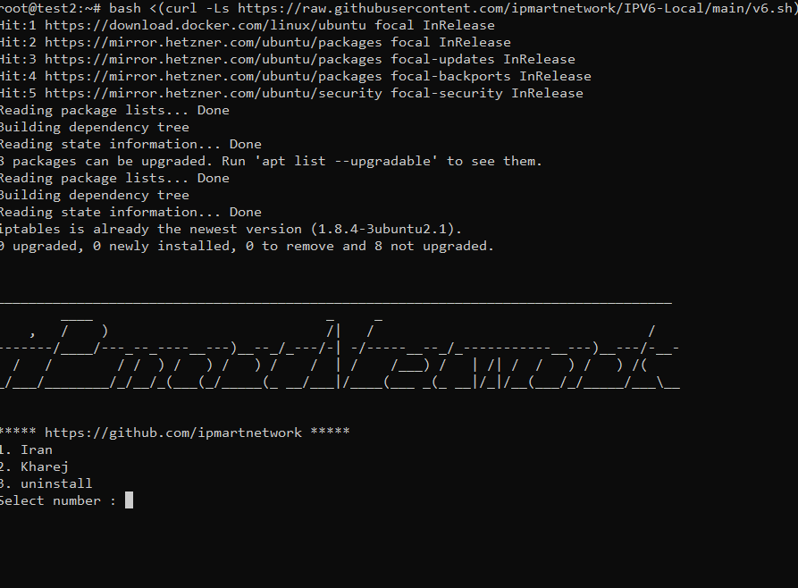

<p align="center">
<picture>

</picture>
  </p> 
<p align="center">
<h1 align="center"/>IPV6-Local</h1>
<h6 align="center">تانل ای پی ورژن 6 و دکو<h6>
</p>


<div align="center">

</div>
</p>
</p>
</p>
</p>

-----------------------------------------------------


برای نصب دستور زیر را در هر دو سرور وارد کنید در سرور خارج (خارج) و در سرور ایران (ایران) انتخاب کنید


### Onclick Install
```
bash <(curl -Ls https://raw.githubusercontent.com/ipmartnetwork/IPV6-Local/main/v6.sh)
```


در مرحله دوم ای پی سرور روبرو را که میخواهید تانل کنید را وارد کنید و در مرحله اخر میتوانید پنل x-ui که روی همین اسکریپت قرار داده شده نصب کنید.


# تلگرام

[@ipmart_network](https://t.me/ipmart_network)

[@iPmart Group](https://t.me/ipmartnetwork_gp)


 # حمایت از ما :hearts:
حمایت های شما برای ما دلگرمی بزرگی است<br> 
<p align="left">
<a href="https://plisio.net/donate/kB7QU7f7" target="_blank"></a><br>
	
|                    TRX                   |                       BNB                         |                    Litecoin                       |
| ---------------------------------------- |:-------------------------------------------------:| -------------------------------------------------:|
| ```TJbTYV1fFo2485sYMyajxGPLFzxmNmPrNA``` |  ```0x4af3de9b303a8d43105e284823d95b4c600961a3``` | ```MPrkzFiNtw4Rg67bbZB6gCxa9LV87orABM``` |	

</p>	


<p align="center">
<picture>

</picture>
  </p> 
